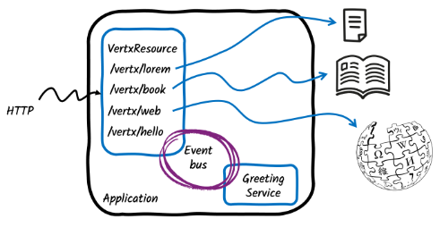

# Getting Started with Vert.x in Quarkus 

* goal
  * Quarkus application / exposes 4 HTTP endpoints
    1. `/vertx/lorem`
       * 's return
         * small file's content
    2. `/vertx/book`
       * 's return
         * large file (a book)'s content
    3. `/vertx/hello`
       * 's return  
         * -- via -- Vert.x event bus
    4. `/vertx/web`
       * retrieve data -- , via Vert.x Web Client, from -- Wikipedia

    

* [Quarkus - Vertx guide](https://quarkus.io/guides/vertx)

##  how has it been created?
* `quarkus create app -P io.quarkus.platform:quarkus-bom:3.22.3 org.acme:kubernetes-quickstart --extension='rest-jackson,vertx'`
* add the dependency `io.smallrye.reactive:smallrye-mutiny-vertx-web-client`
  * | pom.xml

    ```xml
    <dependency>
      <groupId>io.smallrye.reactive</groupId>
      <artifactId>smallrye-mutiny-vertx-web-client</artifactId>
    </dependency>
    ```

## SockJS example

This example demonstrates how you can send event to a browser from a Quarkus application using the Vert.x SockJS bridge.
Two main files compose this demo:

* [src/main/java/org/acme/extra/SockJsExample.java](./src/main/java/org/acme/extra/SockJsExample.java) - configure the SockJS bridge and send _ticks_ every seconds
* [src/main/resources/META-INF/resources/sockjs-example.html](src/main/resources/META-INF/resources/sockjs-example.html) - a simple web page receiving the events

After having started the application, open your browser to http://localhost:8080/sockjs-example.html.

## Reactive PostgreSQL example

This example demonstrates how you can use the Vert.x PostgreSQL client to implement a reactive CRUD application.
Three main files compose this demo:

* [src/main/java/org/acme/extra/Fruit.java](./src/main/java/org/acme/extra/Fruit.java) - represent Fruits
* [src/main/java/org/acme/extra/FruitResource.java](./src/main/java/org/acme/extra/FruitResource.java) - implement the CRUD HTTP interface
* [src/main/resources/META-INF/resources/fruits.html](src/main/resources/META-INF/resources/fruits.html) - the UI

After having started the application, open your browser to http://localhost:8080/fruits.html.


